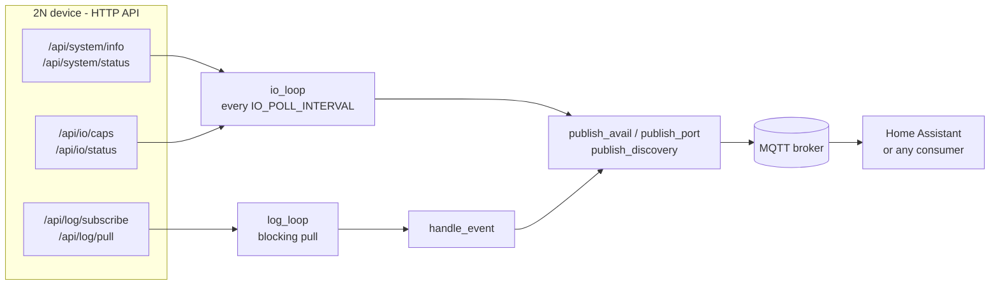

# Architecture

2n2mqtt is one Python process in one container. It reads a single 2N device
over HTTPS and republishes what it learns to an MQTT broker. It is stateless:
nothing is stored on disk, and a restart re-synchronises everything from the
device.

## Components

| # | Component | Where in `2n2mqtt.py` | Responsibility |
|---|---|---|---|
| 1 | Settings | top of the module | Read the environment once, derive topic roots and the API base URL |
| 2 | 2N client | `api` session, `get()` | Digest auth, TLS verification flag, timeouts, error mapping to `AuthError`/`ApiError` |
| 3 | MQTT client | `main()` | paho client with retained LWT, background network loop, `on_connect()` re-asserting availability |
| 4 | I/O loop | `io_loop()` thread | Slow authoritative poll: model, firmware, uptime, inputs, reachability |
| 5 | Event loop | `log_loop()` thread | Own event-log subscription, blocking pulls, event dispatch through `handle_event()` |
| 6 | Discovery | `publish_discovery()` | Home Assistant config topics, once per detected model |
| 7 | Lifecycle | `main()` | Start both threads, SIGTERM handling, orderly shutdown |

## Data flow

Two sources run side by side because neither is sufficient alone:

1. The **event log** delivers access events and input transitions as they
   happen. A pull blocks on the device for up to `LOG_LONG_POLL_TIMEOUT`
   seconds, so an event reaches MQTT within the time of one HTTP round trip.
2. The **slow poll** re-reads the authoritative state every
   `IO_POLL_INTERVAL` seconds (never less than 30). It covers inputs that emit
   no event and repairs anything missed while either side was restarting.

## Startup sequence

1. Settings are parsed. If an event named in `ACCESS_GRANTED_EVENTS` or
   `ACCESS_DENIED_EVENTS` is missing from `LOG_FILTER`, a `[config]` warning
   is logged: the subscription would never deliver it.
2. The MQTT client connects with LWT `offline`. If the broker is unreachable,
   `connect()` raises, the process exits and the Docker restart policy
   (`unless-stopped`) starts it again.
3. First I/O cycle: `/api/system/info` gives the model; in auto port mode
   `/api/io/caps` gives the port list; discovery is published; then firmware,
   uptime, every port, `reachable=ON`, and finally availability `online`.
4. The event loop subscribes, drains the backlog without publishing it and
   remembers the last event id; from then on only newer events are handled.

## Error model

| # | Failure | Detected as | Effect | Recovery |
|---|---|---|---|---|
| 1 | Wrong or empty credentials, missing privilege at HTTP level | HTTP 401/403, `AuthError` | I/O loop: `reachable=OFF`, availability `offline`. Event loop: subscription dropped, back-off doubling from `LOG_POLL_INTERVAL` up to 60 s | Automatic once the device accepts the credentials |
| 2 | Device unreachable, timeout, TLS error | any other exception | I/O loop: `reachable=OFF`, availability `offline`. Event loop: keeps its subscription id, same back-off | Automatic |
| 3 | Transient application error | `ApiError`, not permanent | Logged, topics unchanged | Next cycle |
| 4 | Privilege, licence or unsupported feature | `ApiError.permanent` | I/O polling or the whole access log is switched off for the run | Fix the account, restart the container |
| 5 | Subscription invalid (device reboot, expiry) | `ApiError` mentioning the subscription | New subscription, backlog skipped again | Automatic |
| 6 | Device rebooted while the bridge runs | uptime lower than the previous poll | `device/restarted` gets a timestamp | None needed |
| 7 | Broker connection lost | paho | Broker publishes the retained LWT `offline`; paho reconnects; `on_connect()` re-asserts the last availability | Automatic |

Access events that happen while no subscription exists (between rows 1 or 5
and the new subscription) are skipped with the backlog; inputs are corrected
by the next poll, access events are not replayed.

## Design decisions

1. **Read-only by design.** Only monitoring and I/O status endpoints are
   called. An account able to drive the relay could open the door, so the
   bridge neither needs nor accepts such privileges.
2. **Own subscription, `include=all`.** Each subscription has an independent
   queue on the device, so the bridge never steals events from another
   consumer. `include=new` was tried: the device accepts it and never
   delivers an event. Old events are skipped by id instead.
3. **The device is the authority on errors.** It answers HTTP 200 to
   application errors, so `success` in the body decides. Privilege and licence
   errors turn a feature off; the bridge never retries or works around them.
4. **Retained state, non-retained events.** A late consumer sees the current
   state immediately; `access/event` is not retained because a replayed
   event would look fresh.
5. **Availability is remembered.** The LWT is retained, so after a reconnect
   the broker holds `offline` until someone overwrites it: `on_connect()`
   does, with the last value the bridge asserted.
6. **Role aliases.** Consumers subscribe to `io/tamper` and `io/door` without
   knowing how a given model names its inputs.
7. **Event names are settings.** They differ between firmware families; the
   startup warning catches a classification list that the filter would never
   feed.
8. **Privacy switch.** With `PUBLISH_USER_NAMES=false` the name is replaced
   by the first 12 hex digits of its SHA-256: stable enough to tell visits
   apart, meaningless on its own.
9. **Gentle polling.** The device runs real access control; the poll interval
   has a hard floor of 30 s and every failure path backs off.

## Load on the device

- Per I/O cycle: `2 + N` GET requests (`/api/system/info`,
  `/api/system/status`, one `/api/io/status` per published port), every
  `IO_POLL_INTERVAL` seconds.
- Event log: one pull open at a time. When quiet, one request every
  `LOG_LONG_POLL_TIMEOUT` seconds; after an event, extra non-blocking pulls
  until the queue is empty. With `LOG_LONG_POLL_TIMEOUT=0`, one pull every
  `LOG_POLL_INTERVAL` seconds.
- Discovery and `/api/io/caps` only at startup and when the model changes.

## Scaling to more devices

One process serves one device. For a second device, run a second copy of the
project with its own `.env`: `DEVICE_ID`, `STATE_PREFIX` and `MQTT_CLIENT_ID`
must all differ (two clients with the same id keep disconnecting each other),
and the `container_name` from `docker-compose.yml` must be overridden in that
copy's `docker-compose.override.yml`.

## External dependencies

| # | Dependency | Used for | Notes |
|---|---|---|---|
| 1 | 2N HTTP API | all device data | HTTPS, self-signed certificate, Digest auth; census in [API.md](API.md#2n-http-api-census) |
| 2 | MQTT broker | output | MQTT 3.1.1 via paho-mqtt 2.1.0, keepalive 60 s |
| 3 | Home Assistant | optional consumer | MQTT discovery only |
| 4 | `requests` 2.32.3, `paho-mqtt` 2.1.0 | runtime | pinned in `requirements.txt` |
